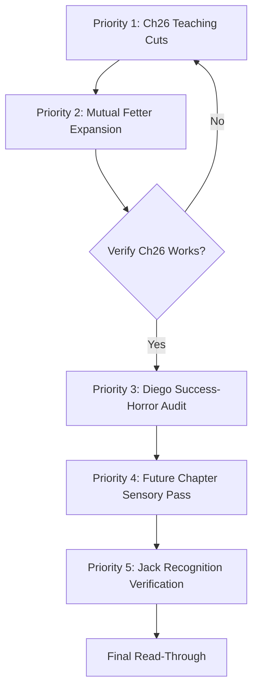

# WHEEL OF MEAT — New Revision Plan (Post-Editorial Analysis)

**Manuscript:** Draft 1.16.26
**Based on:** Developmental Editorial Report (January 16, 2026)
**Purpose:** Implementation roadmap for Big Picture Recommendations

---

## Revision Overview

This plan translates the five Key "Big Picture" Recommendations from the editorial report into actionable revision tasks. Each recommendation has been expanded with specific implementation guidance, file locations, acceptance criteria, and dependency notes. Execute in order.

---

## PRIORITY 1: Reduce Chapter 26 Teaching Section's Expository Weight

**Priority:** CRITICAL
**Source:** Editorial Report Section: Key Recommendation #1
**Status:** [ ] Not started
**Estimated effort:** Medium (strategic cuts + demonstrative additions)
**Dependencies:** Requires verification of 2.0 (mutual fetter dissolution) immediately afterward

### Problem Statement

Chapter 26's teaching section (Scene 04) carries too much philosophical explainer. The merged entity *tells* villagers what it has learned rather than *showing* accumulated lessons in action. The teaching reads as lecture rather than demonstration, undercutting the manuscript's core "show don't tell" principle at its climactic moment.

**Current state:** Scene 04 (`CH26-scene-04.md`) contains ~2,400 words of teaching, primarily delivered as spoken philosophy. While eloquent, this approach:
- Creates tonal inconsistency with the preceding scenes' demonstrative approach
- Risks reader fatigue at a moment requiring maximum engagement
- Violates the manuscript's own theme: wisdom is lived, not stated

### The Integrated Solution

The teaching must demonstrate accumulated lessons through *what the entity does*, not primarily through what it says. The ten perfections should emerge as event rather than exposition.

**Target cuts:** 40-50% reduction in stated philosophy (approximately 1,000-1,200 words removed)

**Target additions:** 400-600 words of demonstrative action showing integrated lessons

### Implementation

#### Phase 1: Strategic Cuts in Scene 04

**Identify and cut:**
- Generic philosophical statements that don't echo specific incarnation lessons
- Redundant explanations of concepts already demonstrated in prior scenes
- Extended metaphors that delay rather than illuminate
- Any passage where villagers are told what they should understand

**Preserve:**
- The "chain" callback (echoes Chapters 1 and 22)
- The "Tat Tvam Asi" moving beyond ("There is no 'that.' There is no 'thou.'")
- The brief incarnation testimonies (Ka, Macarius, hands that healed)
- "The trying was not nothing" echo (links to Jack Malone)
- The final teaching dissolution ("Teaching does not end, only speaking pauses")

**Specific lines to consider for reduction (CH26-scene-04.md):**

| Lines | Content | Recommendation |
|-------|---------|----------------|
| 17-29 | Stewart question callback + error explanation | KEEP (essential callback) |
| 33-54 | "Tat Tvam Asi" section | KEEP core, TRIM expansion |
| 57-66 | "The wheel turns" section | TRIM by 30% |
| 69-84 | Story testimonies | KEEP (show through testimony) |
| 87-96 | "The trying is meaningful" | KEEP (Jack echo) |
| 99-111 | "What is being spoken" section | TRIM by 50% or CUT |

#### Phase 2: Demonstrative Action Beats

**Add new material showing the ten perfections in action:**

| Perfection | Demonstrated By | Implementation |
|------------|-----------------|----------------|
| **Generosity (dāna)** | Entity gives bread to a hungry traveler without self-reference | Brief beat before/during teaching |
| **Virtue (sīla)** | Entity refuses a flattering title offered by an elder | Single exchange during gathering |
| **Renunciation (nekkhamma)** | Entity does not claim credit for the teaching arising | Built into existing structure |
| **Wisdom (paññā)** | Entity stays with someone dying, doesn't promise false comfort | New beat: villager in final hours |
| **Energy (vīriya)** | Entity continues teaching despite exhaustion | Physical detail within existing scene |
| **Patience (khanti)** | Entity absorbs a challenge/criticism without defense | New beat: skeptic questions teaching |
| **Truthfulness (sacca)** | Entity admits uncertainty when asked what comes after death | Modify existing passage |
| **Determination (adhiṭṭhāna)** | Entity returns to teaching after interruption | Already present in structure |
| **Loving-kindness (mettā)** | Entity's attention rests equally on each listener | Detail during teaching |
| **Equanimity (upekkhā)** | Entity's manner unchanged when praised vs. questioned | Contrast across interactions |

**Focus on 3-4 key demonstrations** rather than all ten. The most impactful:
1. **Staying with the dying** (callbacks to Jack's "trying matters," Wei's determination)
2. **Giving without self-reference** (Chandra's lesson completed)
3. **Acting under uncertainty** (Verinus's lesson completed)
4. **Facing challenge without hatred** (Diego's lesson completed)

#### Phase 3: Scene Structure Revision

**Current Scene 04 structure:**
1. Gathering description
2. Teaching begins (spoken)
3. "Tat Tvam Asi" discussion
4. "Wheel turns" discussion
5. Story testimonies (Ka, desert, hands)
6. "Trying is meaningful"
7. Teaching conclusion
8. Dispersal

**Revised structure (integrated showing):**
1. Gathering description
2. **NEW: Entity assists a dying elder** (Wisdom in action)
3. Teaching begins (spoken, abbreviated)
4. **NEW: Skeptic challenges; Entity responds without defense** (Patience in action)
5. "Tat Tvam Asi" moving beyond (trimmed)
6. Story testimonies (kept intact)
7. **NEW: Entity gives food to hungry child without comment** (Generosity in action)
8. "Trying is meaningful" (kept)
9. Teaching conclusion (kept)
10. Dispersal

### File Locations

| File | Action Required |
|------|-----------------|
| `incarnations/ch26-pure-abodes-awakened/scenes/CH26-scene-04.md` | Major revision: cuts + additions |
| `incarnations/ch26-pure-abodes-awakened/scenes/CH26-scene-03.md` | Minor review: ensure build to teaching |

### Acceptance Criteria

- [ ] Scene 04 word count reduced by 40-50% (from ~2,400 to ~1,200-1,400)
- [ ] Minimum 3 demonstrative action beats added showing perfections in practice
- [ ] "Staying with the dying" beat present (Wei/Jack echo)
- [ ] "Giving without self-reference" beat present (Chandra echo)
- [ ] "Acting under uncertainty" beat present (Verinus echo)
- [ ] All incarnation-specific callbacks preserved (Ka, desert, hands that healed, trying)
- [ ] "Tat Tvam Asi" critique preserved but trimmed
- [ ] Teaching reads as demonstration first, explanation second
- [ ] Villagers' response feels earned through witnessing, not told
- [ ] No remaining passages where entity tells villagers what to understand

---

## PRIORITY 2: Strengthen Mutual Fetter Dissolution in Chapter 26

**Priority:** CRITICAL
**Source:** Editorial Report Section: Key Recommendation #2
**Status:** [ ] Not started
**Estimated effort:** Medium (expansion + dramatization)
**Dependencies:** Should be verified immediately after Priority 1

### Problem Statement

The recognition that Lilith and Silas "were one gesture, wearing two faces" is the book's climactic insight, but it arrives with insufficient dramatization. The mutual fetter dissolution happens too quickly, is stated more than shown, and lacks the resistance that would make surrender meaningful.

**Current state:** Scene 02 (`CH26-scene-02.md`) contains the chain echo and dissolution, but:
- The insight arrives in ~200 words spanning lines 75-116
- Both fetters dissolve nearly simultaneously with minimal struggle
- The "cost" of dissolution is not felt
- The reader is told the pattern was seen rather than experiencing the seeing

### The Integrated Solution

The seeing must happen in real time, must encounter resistance, and must cost something before it completes. Neither pattern is subordinated; both dissolve *together*, through a process that the reader experiences rather than is told about.

**Key principle:** The dissolution is the book's payoff for 300,000 years of narrative. It cannot be rushed. Expand this section from ~200 words to ~600-800 words, adding:
1. Internal resistance from each pattern before surrender
2. The physical/sensory experience of dissolution
3. The "cost"—what it feels like to release the identity
4. The mutual simultaneity (neither first, neither second)

### Implementation

#### Phase 1: Expand "She Saw" Section (Lines 75-84)

**Current:** 
> *She* saw.
> 
> The anchor. She had always been the anchor...

**Add before the insight:**
- Her pattern's resistance: "But if anchor was contribution—if competition was participation—then she had never been obstructing. She had never been winning. She had never been *separate*."
- The cost: "The identity of 'the one who achieves first' fought for survival. Died fighting. Died without surrender, which was its own form of surrender—resistance that couldn't sustain itself when seen."
- Physical sensation: The shimmer in her chest (mentioned earlier) should respond—flicker, intensify, begin to thin

**Target expansion:** 150-200 additional words

#### Phase 2: Expand "He Saw" Section (Lines 87-96)

**Current:**
> *He* saw.
>
> The reacher. He had always been reaching...

**Add before the insight:**
- His pattern's resistance: "But if patience was grasping—if waiting was reaching—then he had never been still. He had never been receptive. He had never been *not-acting*."
- The cost: "The identity of 'the one who endures' fought for survival. Its fight looked like stillness, like acceptance, but the stillness was grasping too. When seen, it couldn't remain unseen."
- Physical sensation: Something loosening in his chest that mirrors her shimmer

**Target expansion:** 150-200 additional words

#### Phase 3: Expand "Both Saw" Section (Lines 99-116)

**Current:**
> *Both* saw.
>
> The separation between anchor and reacher was never real...

**This is too fast.** Add:

1. **The simultaneity visualization:**
   - "Not sequence—her seeing his, his seeing hers—but the same seeing wearing two angles"
   - "Like binocular vision suddenly resolving into depth: not two images merging but one image always there, requiring two vantage points to perceive"

2. **The shared physical experience:**
   - Both patterns experiencing the same sensation of dissolution
   - The shimmer stilling in her while something loosens in him, but experienced as *one event*
   - "The breath that left her body was the breath that entered his, or the other way around, or neither—sequencing collapsing with the separation that had made sequence possible"

3. **The cost made visceral:**
   - "For a fraction of a second that stretched beyond time, there was loss. Not the loss of something good—identity had never been good, only familiar—but the loss of the familiar. The sensation of falling without ground. The terrifying freedom of having nothing left to protect."

4. **The completion:**
   - "Then: arrival. Not at a destination but as recognition that arriving had already happened. The chain held. Had always held. The counting that made 'three' possible had been the only thing that ever threatened to break it."

**Target expansion:** 200-300 additional words

### File Locations

| File | Action Required |
|------|-----------------|
| `incarnations/ch26-pure-abodes-awakened/scenes/CH26-scene-02.md` | Major expansion: lines 75-116 |

### Cross-References

| Location | Echo Required |
|----------|---------------|
| CH01-scene-09 (rooftop) | Chain geometry first appears |
| CH22-scene-01 (breakthrough) | Chain geometry resolves Stewart crisis |
| CH26-scene-02 | Chain geometry completes with mutual dissolution |

The three instances should rhyme:
- CH01: Chain *threatens* to break (Stewart falling)
- CH22: Chain *holds* through reaching (Silas saves Stewart)
- CH26: Chain *dissolves* because counting stops (mutual fetter release)

### Acceptance Criteria

- [ ] "She saw" section expanded with resistance, cost, and physical sensation (150-200 words)
- [ ] "He saw" section expanded with resistance, cost, and physical sensation (150-200 words)
- [ ] "Both saw" section expanded with simultaneity, shared experience, and completion (200-300 words)
- [ ] Neither fetter dissolves "first"—simultaneity is dramatized, not stated
- [ ] Physical sensations accompany the dissolution (not just conceptual recognition)
- [ ] The "cost" of releasing identity is viscerally present (the freedom is terrifying before it is peaceful)
- [ ] Chain imagery connects to CH01 and CH22 explicitly
- [ ] Pronoun shift from "we" follows organically from the dissolution
- [ ] Revised section total: ~600-800 words (up from ~200)

---

## PRIORITY 3: Verify Diego's "Success-Horror" Lands with Full Impact (Chapter 14)

**Priority:** HIGH
**Source:** Editorial Report Section: Key Recommendation #3
**Status:** [ ] Not started (verification task)
**Estimated effort:** Low-Medium (audit + targeted additions if needed)
**Dependencies:** Should be verified before moving to Priority 4

### Problem Statement

Chapter 14 (Diego's Inquisition chapter) is the manuscript's formula-break—the one time Lilith *succeeds* in breaking her target, and success is worse than failure. The horror must be proportional to what is destroyed: six lifetimes of accumulated progress visibly present in Diego's behavior *before* the Inquisition breaks him.

**Critical question:** Do readers see what is being lost? The tragedy requires witnessing Diego's integrated lessons in action before watching them shattered.

### Verification Framework

**The Six Integrated Lessons Diego Must Demonstrate:**

| Lesson | Source Life | How Diego Shows It | Current Status |
|--------|-------------|-------------------|----------------|
| **Cooperation** | Ka | Works with other physicians, shares knowledge with apprentices | [ ] Verify |
| **Generosity** | Ka/Chandra | Treats patients regardless of ability to pay; shares medical supplies | [ ] Verify |
| **Wisdom** | Chandra/Philon | Makes accurate diagnoses; knows when not to intervene | [ ] Verify |
| **Virtue** | Philon/Verinus | Maintains ethical practice under pressure; refuses harmful treatments | [ ] Verify |
| **Renunciation** | Verinus/Macarius | Works without expectation of recognition; lives simply | [ ] Verify |
| **Equanimity** | Macarius/Kaoru | Maintains composure facing Inquisition; treats accusers as patients | [ ] Verify |

**Current state (based on CH14-scene-01 review):** Diego is established as:
- A skilled converso physician practicing under danger
- Careful, methodical, value-based in his approach
- Aware of the Inquisition threat through Sor Catalina's presence
- The scene shows his professionalism and restraint

**Verification needed:** Are all six lessons *visibly demonstrated* before the breaking?

### Implementation

#### Phase 1: Chapter 14 Audit

**Read all CH14 scenes and track each lesson's demonstration:**

| Scene | Lessons Shown | Notes |
|-------|---------------|-------|
| Scene 01 | | |
| Scene 02 | | |
| Scene 03 | | |
| Scene 04 | | |
| Scene 05 | | |
| Scene 06 | | |

**Flag any lessons that are:**
- Absent entirely
- Implied but not shown through specific action
- Present but could be strengthened

#### Phase 2: Targeted Additions (if needed)

For each lesson not clearly demonstrated, add 50-100 words showing Diego enacting it. Examples:

**Cooperation (if missing):**
> Diego consulted with the older physician, Martín de Córdoba, whose methods he had adapted rather than replaced. "Your instinct about the fever pattern," he told the old man, "saved this one. I would have bled her too soon."

**Generosity (if missing):**
> The widow could not pay. Diego wrote *No charge—tithework* in his ledger, though tithing to the Church would cost him later and this was not, precisely, the Church's work.

**Equanimity (if missing):**
> Sor Catalina's eyes burned with holy certainty. Diego met them with the same calm he offered dying patients. "Sister, I have only ever wanted to heal."

#### Phase 3: Verify Hidden Backfire Seed

**Requirement:** Diego's breaking must still produce patience—through endurance of destruction rather than triumph. The mechanism should be:
- Visible to readers (through his death-moment or final gesture)
- Invisible to Lilith (she believes she has finally won)

**Look for:**
- Diego's death poem or final words
- His physical comportment during torture/execution
- Any moment where his composure suggests the lesson learned through the breaking itself
- Lilith's interpretation in Chapter 15 (she should miss what readers see)

### Verification Against Chapter 15

**Chapter 15 must show:**
- Lilith's dawning horror as she realizes what she destroyed
- Her rationalization that this time was different, this was success
- Her failure to see that the breaking produced exactly what she feared (patience through endurance)
- Reader understanding of the hidden backfire that Lilith misses

**Check CH15-scene-01 for:**
- [ ] Lilith's awareness of Diego's accumulated lessons
- [ ] Her belief that she succeeded
- [ ] The ironic gap between her interpretation and the reader's understanding
- [ ] The acceleration mechanism: her "success" accelerates his progress even more than failure would

### File Locations

| File | Action Required |
|------|-----------------|
| `incarnations/ch14-inquisition-accused/scenes/CH14-scene-*.md` | Audit for six lessons |
| `incarnations/ch15-lilith-cp07/scenes/CH15-scene-01.md` | Verify horror + hidden backfire |

### Acceptance Criteria

- [ ] All six integrated lessons (cooperation, generosity, wisdom, virtue, renunciation, equanimity) are demonstrably present in Diego's behavior before the breaking
- [ ] Each lesson is shown through specific action, not stated through narration
- [ ] Diego's death/breaking includes a visible gesture of transformation (the lesson learned through destruction)
- [ ] This gesture is visible to readers but invisible/misinterpreted by Lilith
- [ ] Chapter 15 shows Lilith's belief that she succeeded
- [ ] Chapter 15 creates ironic gap: reader sees hidden backfire, Lilith does not
- [ ] The horror of the success-moment is proportional to what was destroyed
- [ ] No new plot additions required (this is verification + targeted strengthening)

---

## PRIORITY 4: Ground Far-Future Chapters in Sensory Specificity

**Priority:** HIGH
**Source:** Editorial Report Section: Key Recommendation #4
**Status:** [ ] Not started
**Estimated effort:** Medium (sensory addition pass)
**Dependencies:** Can be done in parallel with Priority 3

### Problem Statement

Chapters 24-25 (Silex/Lith in the Eternal Synthesis future) risk abstraction. The "sterile perfection" of engineered existence must be *felt* through the body—the exact temperature of optimized air, the hollow quality of designed nutrition, the absence of randomness and surprise.

**Current state (based on CH24-scene-01 review):** The scene establishes:
- Emergence into designed bodies
- The "hollow" quality of the Eternal Synthesis protocols
- The wrongness of perfect calibration
- Good conceptual foundation

**What's missing:** The visceral, bodily experience of this wrongness. Readers need to *feel* the sterility, not just understand it conceptually.

### The Integrated Solution

Apply the same sensory density that grounds the historical chapters. The future should feel as physically specific as Ka's cave or Diego's pharmacy—but *wrong* in ways that demonstrate the sterility of designed existence versus organic embodiment.

**Key principle:** The Ka bookend. Chapter 2 (prehistoric cave) and Chapters 24-25 (far future) are narrative bookends. They should rhyme:

| Ka (Chapter 2) | Silex/Lith (Chapters 24-25) |
|----------------|----------------------------|
| Raw cold | Calibrated temperature |
| Hunger | Designed satiation |
| Isolation in tribe | Isolation in network |
| Hoarding meat | Hoarding data/consciousness |
| Cave darkness | Facility precision-lighting |
| Organic uncertainty | Engineered predictability |

### Implementation

#### Phase 1: Sensory Audit of Chapter 24

**Read CH24-scene-01 and catalog existing sensory details:**

| Sense | Current Usage | Enhancement Needed |
|-------|---------------|-------------------|
| Sight | | |
| Sound | | |
| Touch | | |
| Smell | | |
| Taste | | |
| Proprioception | | |

#### Phase 2: Sensory Enhancement Pass

**Add to each emergence sequence:**

**Silex (his emergence):**
- Exact temperature of fabrication chamber (40.2°C—not warm, not cool, precisely body-neutral)
- The texture of synthetic amniotic draining (too smooth, no particulates, no organic variation)
- The sound of calibrated frequencies (40Hz, exactly 40Hz, designed tranquility that cannot surprise)
- First breath tastes of *nothing*—filtered atmosphere without microparticles, without organic markers
- His body's first movement against surfaces designed for frictionless contact

**Lith (her emergence):**
- The neural interface click at skull-base (small, precise, permanent)
- Surfaces too smooth for organic touch (polished beyond natural variation)
- The absence of smell (no dust, no pollen, no weather, no world)
- Her skin's first contact with designed air (humidified to tenth of a degree)
- The wrongness of a body that has never known surprise

**Both (shared sensory environment):**
- Light calibrated beyond organic range (colors that shouldn't exist, too pure)
- Sound dampened beyond organic capacity (silence that should not be achievable)
- Temperature maintained beyond variable (no weather, no seasons, no change)

#### Phase 3: Ka Bookend Echoes

**Plant specific echoes between Ka and Silex/Lith:**

| Ka Detail | Silex/Lith Parallel |
|-----------|---------------------|
| "Cave mouth breathes different wind" | Fabrication chamber breathes calibrated air |
| "Tongue blood. Teeth bite in sleep" | First taste is designed nutrition—no surprise |
| "Body knows bad coming before mind knows" | Body reads protocols before consciousness forms question |
| "Air wrong on skin. Wrong smell in nose" | Air precisely right—and that precision is the wrongness |
| Cold that seeps through hide | Warmth that never varies, never permits cold |
| Meat freezing in Ka's hands | Consciousness that cannot be held, distributed across substrate |

#### Phase 4: Verify Sunset/Sunrise Palette

**The manuscript's color bookends:**
- Ka's awakening: "Dawn red like fresh meat" (Chapter 2)
- Silex/Lith's emergence: [verify palette in CH24]
- Final awakening: "Morning light painted colors—gold and rose and deep blue" (CH26)

**Ensure:**
- Chapter 24 uses palette language that contrasts with organic chapters
- The Eternal Synthesis environment has *designed* colors—too pure, too consistent
- The grounded village in Chapter 26 returns to organic color palette (arrival colors)

### File Locations

| File | Action Required |
|------|-----------------|
| `incarnations/ch24-future-prophet/scenes/CH24-scene-01.md` | Sensory enhancement pass |
| `incarnations/ch24-future-prophet/scenes/CH24-scene-*.md` | Extend enhancement to all scenes |
| `incarnations/ch25-deva-dissolution/scenes/*.md` | Verify sensory continuity |
| `incarnations/ch02-prehistoric-ka/scenes/*.md` | Reference for Ka echoes |

### Acceptance Criteria

- [ ] Each of the five senses + proprioception addressed in emergence sequences
- [ ] The *wrongness* of sterile perfection is felt physically, not just stated conceptually
- [ ] Minimum 5 specific Ka echoes planted across Chapters 24-25
- [ ] Color palette language established and contrasted with organic chapters
- [ ] Chapter 26 village explicitly returns to organic sensory register
- [ ] No emergence detail is generic—all specifics are engineered/designed/calibrated
- [ ] The body's discomfort with designed existence is visceral, not abstract
- [ ] Total addition: ~300-500 words of sensory detail across Ch24-25

---

## PRIORITY 5: Complete Jack Malone's Recognition Scene (Chapter 20)

**Priority:** HIGH
**Source:** Editorial Report Section: Key Recommendation #5
**Status:** [ ] Verification needed
**Estimated effort:** Low (appears partially complete—verify)
**Dependencies:** None

### Problem Statement

Chapter 20 (Jack Malone, noir detective) is the chapter where the protagonist first *recognizes Lilith across incarnations*—a crucial escalation beat. The editorial report flagged this as potentially incomplete, based on Scene 01 showing only "Word count: ~1,650" and Scene 02 similarly truncated.

**Update based on file review:** Scenes 03-08 exist and are fully drafted. Scene 08 contains Jack's death and visionary recognition sequence. Scenes 01-02 appear to be placeholder/word count files.

### Verification Framework

**Jack must demonstrate across Chapter 20:**

| Requirement | Scene Location | Status |
|-------------|----------------|--------|
| Nine lifetimes of accumulated wisdom visible in behavior | Throughout | [ ] Verify |
| First glimpse of Lilith that triggers familiarity | Scene 03 (bar) | [ ] Verify |
| Second encounter with stronger recognition | Scene 08 (alley) | [ ] Verify |
| "Soul-memory" recognition that transcends conscious knowledge | Scene 08 | [x] Present |
| Refusal of her orchestration / acting against trap | Scene 08 | [ ] Verify |
| Death-moment vision of prior lives | Scene 08 | [x] Present |

### Current State (from file review)

**Scene 03:** Jack sees a woman in a bar with "widow's peak," "single darker strand," and feels "a sense of recognition I couldn't place." She disappears before he can approach.

**Scene 08:** Jack's death includes:
- Visible encounter with the woman before the car bomb
- Eye contact with her strange eyes (pale green crescent in left eye)
- His recognition: "She knew. I don't know how I knew she knew, but I did."
- His death-moment vision of prior lives: temple floor, battlefield, plague city, desert cave, philosopher's cell, palace chamber, ship in storm
- His understanding of the pattern: "the same soul learning the same lessons in a thousand different bodies"
- The lesson crystallized: "The trying was not nothing"

### Verification Checklist

**Already confirmed present:**
- [x] Widow's peak / darker strand identification
- [x] Strange eye coloring (Lilith marker)
- [x] Recognition without conscious understanding
- [x] Death-moment multi-life vision
- [x] "Trying matters" lesson articulated
- [x] Sense of chain loosening ("the need to be the one who fixed things... loosening")

**Need to verify:**
- [ ] Jack demonstrates nine lifetimes of wisdom in his actions (cooperation, generosity, wisdom, virtue, renunciation, equanimity, patience, truthfulness, determination)
- [ ] The recognition triggers behavioral change (does Jack act differently because of the recognition?)
- [ ] Lilith's near-panic is visible in her departure (does she leave because she sees something unexpected in him?)

### Implementation (if gaps found)

#### If Nine-Lifetime Wisdom Not Visible

Add brief demonstrations across Scenes 03-07:

| Lesson | Demonstration Opportunity |
|--------|--------------------------|
| Cooperation | Jack working with informants, sharing credit |
| Generosity | Pro bono work, protecting witnesses without payment |
| Wisdom | Accurate assessments, knowing limits |
| Virtue | Refusing bribes, maintaining ethics under pressure |
| Renunciation | Living simply, not seeking recognition |
| Determination | Continuing despite failures, "trying matters" |
| Patience | Waiting for right moment, not forcing |
| Truthfulness | Honest reports despite consequences |
| Equanimity | Maintaining composure facing death |

#### If Recognition Doesn't Trigger Change

Add 50-100 words in Scene 08 where the recognition shifts Jack's final moments:
- He sees her and *chooses* not to flee
- His knowledge of what she represents (without naming it) makes his death intentional
- The "trying matters" lesson is solidified by the recognition

#### If Lilith's Fear Not Visible

Her departure in Scene 08 reads as: "she started to move—not toward me, but away, turning, beginning to walk quickly down the sidewalk, as if she could see what was coming and wanted to be gone before it arrived."

**Potential addition:** Interior glimpse of what frightens her—he has seen her, *really* seen her, more clearly than any prior incarnation. This recognition means the next life will be different.

### Impact on Chapter 21 (Lilith Tracking)

**Chapter 21 must show:**
- Lilith's processing of Jack's recognition
- Her near-panic that he saw through her appearances
- Her calculation that contemporary Silas may already have this capacity
- Accelerated urgency toward final pursuit

**Verify CH21 contains:**
- [ ] Lilith registering that Jack recognized her
- [ ] Her alarm at what this means for contemporary pursuit
- [ ] Transition toward the contemporary breakthrough sequence

### File Locations

| File | Action Required |
|------|-----------------|
| `incarnations/ch20-noir-detective/scenes/CH20-scene-01.md` | Placeholder—check if intentional or draft gap |
| `incarnations/ch20-noir-detective/scenes/CH20-scene-02.md` | Placeholder—check if intentional or draft gap |
| `incarnations/ch20-noir-detective/scenes/CH20-scene-03.md` | Verify first Lilith sighting works |
| `incarnations/ch20-noir-detective/scenes/CH20-scene-08.md` | Verify recognition + death scene complete |
| `incarnations/ch21-lilith-cp10/scenes/*.md` | Verify Lilith's response to recognition |

### Acceptance Criteria

- [ ] Scenes 01-02 status clarified (intentional placeholder or draft gap?)
- [ ] Jack demonstrates accumulated wisdom across Chapter 20 (minimum 5 visible lessons)
- [ ] First Lilith encounter (Scene 03) establishes subliminal recognition
- [ ] Final Lilith encounter (Scene 08) escalates to conscious recognition
- [ ] Jack's death-moment vision includes multi-life awareness
- [ ] "The trying was not nothing" lesson is visible and earned
- [ ] Lilith's departure suggests fear/alarm at being recognized
- [ ] Chapter 21 (Lilith tracking) registers Jack's recognition as escalation
- [ ] This chapter functions as the protagonist's most active agency moment

---

## Revision Flow Summary

### Execution Order

1. **Priority 1** (Ch26 teaching cuts + demonstrative additions)
2. **Priority 2** (Ch26 mutual fetter expansion)
3. **Verify** Ch26 functions correctly before proceeding
4. **Priority 3** (Ch14/15 success-horror audit)
5. **Priority 4** (Ch24-25 sensory grounding)
6. **Priority 5** (Ch20 recognition verification)
7. **Final pass**: Read Chapters 1, 22, 26 in sequence to verify echo architecture

---

## Appendix: Quick Reference

### Chapter 26 Scene Map

| Scene | Function | Priority 1 Action | Priority 2 Action |
|-------|----------|-------------------|-------------------|
| Scene 01 | Arrival | None | None |
| Scene 02 | Recognition (chain echo) | None | Major expansion |
| Scene 03 | Completion (fetter dissolution) | None | Verify connection |
| Scene 04 | Teaching | Major cuts + additions | None |
| Scene 05 | Coda | None | Verify resolution |

### Lilith Marker Consistency

Verify across all appearances:
- Widow's peak ✓
- Single darker strand falling left ✓
- Pale-green crescent in left eye ✓

### Echo Architecture Verification

| Chapter 1 | Chapter 22 | Chapter 26 |
|-----------|------------|------------|
| Sunset colors | Storm/rain | Morning colors |
| Chain threatens | Chain holds | Chain dissolves |
| Solo dissolution (Silas) | Shared dissolution (Silas/Stewart) | Complete dissolution (Silex/Lith) |
| "Tat Tvam Asi" lecture | "Tat Tvam Asi" lived | Beyond "Tat Tvam Asi" |

---

**Document version:** 1.0
**Created:** 2026-01-16
**Author:** Editorial Report Translation
